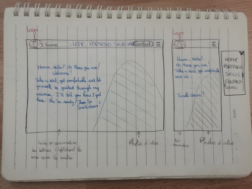
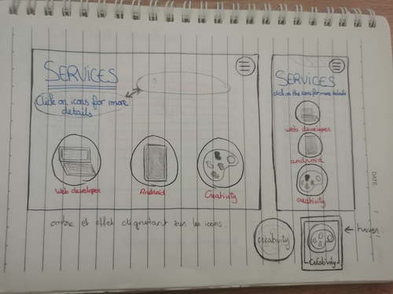
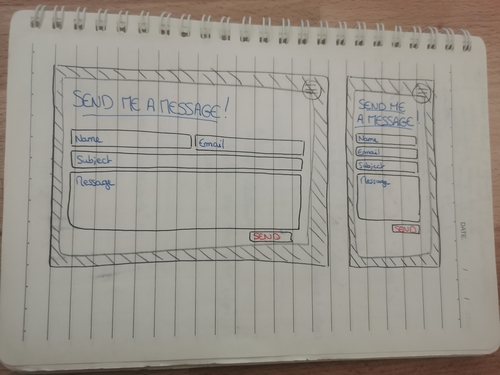
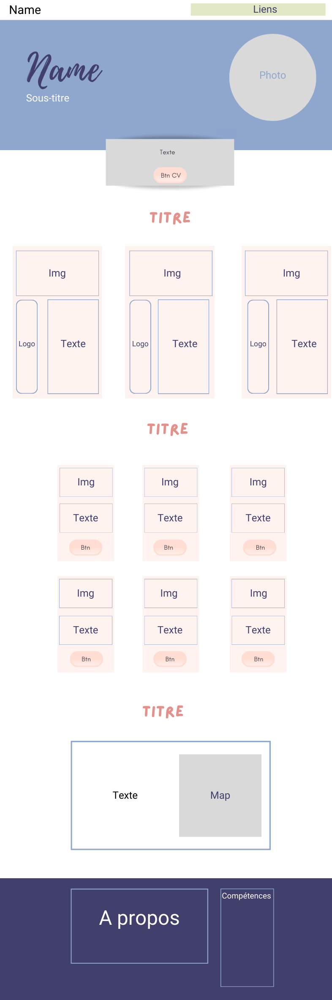
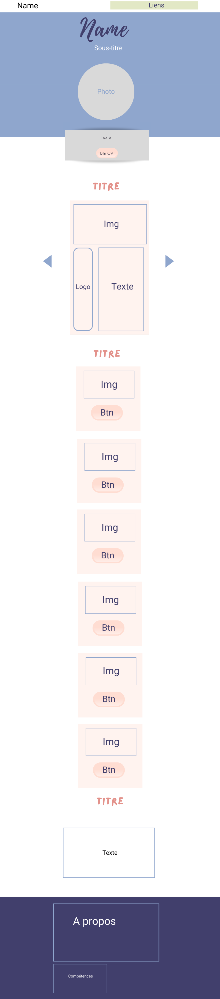

# TP_Portfolio Elodie Bidard

# Etape 1 
- Recherche d'identité graphique. 
- Réalisation de différentes maquettes. 

- Idée de créer un portfolio en anglais. Page d'accueil avec photo et texte d'accueil. 

 

- Création d'un menu pour les compétences. Il aurait fallu cliquer sur les icons pour avoir les détails des compétences. 

- Création d'un formulaire sous forme de modal. La page se serait affiché par dessus le portfolio. 

# Etape 2 
- Réflexion des maquettes et mise au propre : 

> Maquette version pc  

 

> Maquette version téléphone

- Changement de langue pour le portfolio. Abandon de l'anglais pour rester sur le français. Plus facilement lisible pour des recruteurs français. 
- Choix de couleur. 
- Abandon pour le menu des compétences. Optimisation pour un potentiel futur recruteur qui ne voudra pas forcement perdre du temps à cliquer sur des icons pour avoir des informations. Les 3 cards sont visible en format ordinateur et tablette et se transforment en carousel pour les supports téléphones. 
- Abandon du formulaire sous forme de modal pour un formulaire plus classique. 

# Etape 3 
- Réalisation du portfolio. 

## Problèmes rencontrés : 
- Les tailles responsives de Bootstrap n'ont pas toujours été pris en compte. J'ai dû plusieurs fois préciser les responsives à l'aide de media queries.
- Les cards de compétences ont eu énormément de changements. J'avais eu l'idée de détailler chaque compétences par un pourcentage d'expérience mais comme ce n'était pas très indicatif de la réelle expérience que j'ai, j'ai préféré changer mon idée pour simplement utiliser les icons des logiciels que j'utilise et maitrise.  
- Le formulaire d'envois n'est pas encore fonctionnel. Je travaille dessus pour que d'éventuel recruteur puisse me contacter

